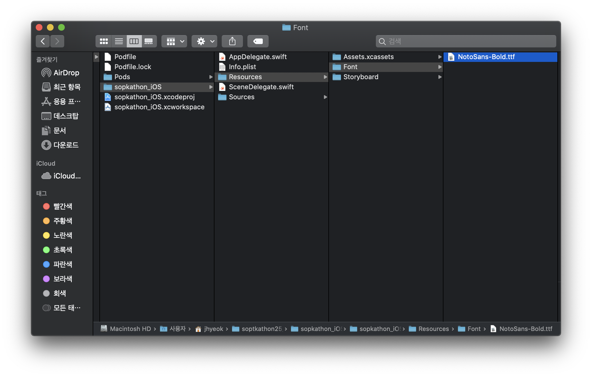

# 폰트 적용

1. 폰트파일(.ttf, .otf) 파일을 프로젝트 폴더에 위치

2. xcode 상에서 폰트 파일을 추가 시킨다.

3. info.plist 파일에 커스텀 폰트를 정의해 줘야한다.
    - 최상위 항목에 **Fonts provided by application**항목을 추가 
    * 추가 시킬 폰트 파일의 확장자를 포함한 파일명을 입력한다.

4. Zeplin에서 텍스트를 지정한 후 표시된 버튼을 누르고 Styleguide 란에 들어가면 해당 폰트 스타일로 정의 된 코드를 자동으로 생성해 준다. 따라서 이를 Export 해서 사용하거나 복사 해서 기존 Font Extension에 사용할 수 있다.
5. 이러한 제플린의 스타일 가이드를 사용하면 폰트 뿐만 아니라 디자이너가 요청한 색상을 정확하게 사용할 수가 있다.

#iOS
